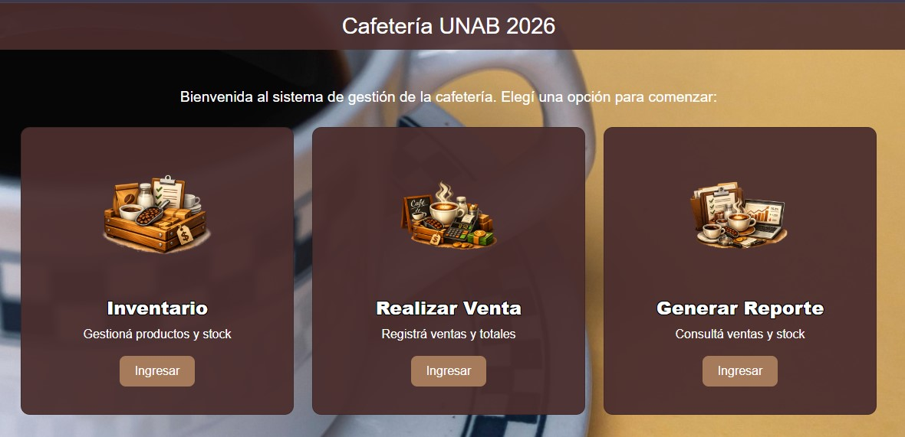
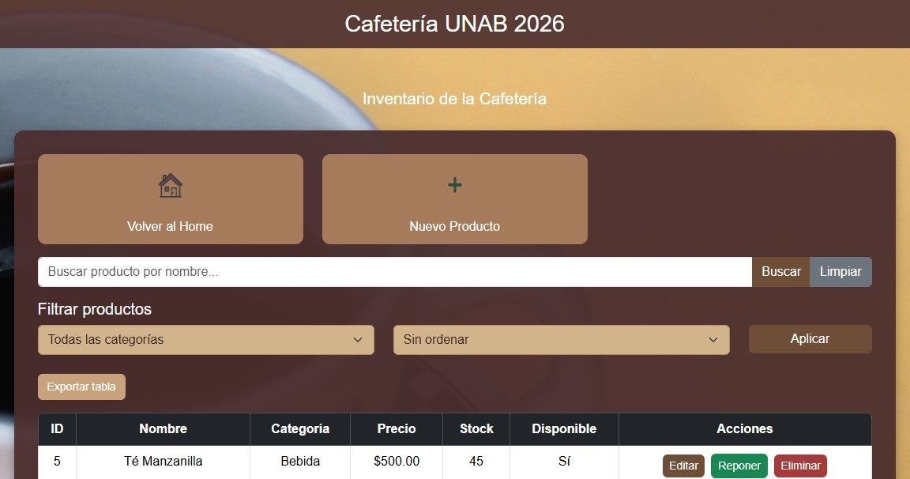
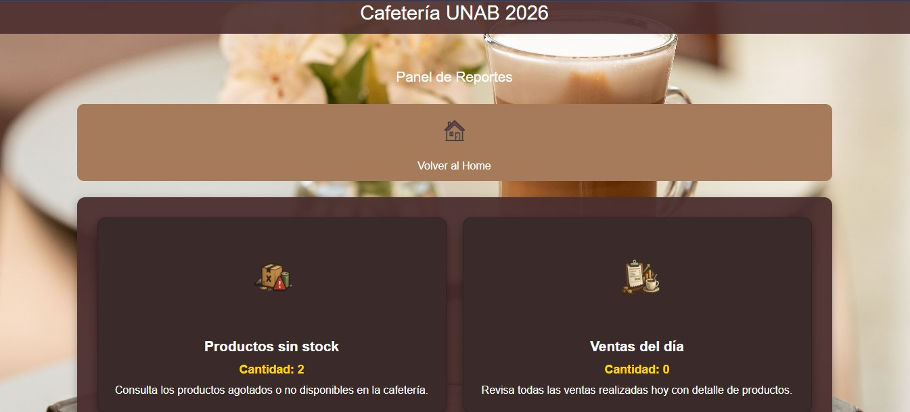

# Gestión de Cafetería - Gestión de Ventas
Proyecto integrador de Programación Avanzada (UNAB 2026).  
Aplicación web desarrollada con **Flask, Python y MySql** para la gestión de productos de una cafetería.

> Este repositorio es una copia personal del proyecto grupal, que voy a seguir mejorando y documentando como parte de mi portafolio en GitHub.

## Funcionalidades
- Alta, edición y eliminación de productos
- Actualización de stock
- Registro de ventas
- Reportes simples de inventario

## Tecnologías
- Python 
- Flask
- MySQL
- Bootstrap (interfaz web)

## Estructura del proyecto
- `app.py` → punto de entrada de la aplicación
- `database.py` → conexión a la base de datos
- `models.py` → clases principales (Producto, Venta, Inventario)
- `templates/` → vistas HTML con Jinja2
- `static/` → estilos CSS y recursos estáticos
- `crear_db.py` → script para inicializar la base
- `tests/` → pruebas unitarias
- `docs/` → documentación y diagramas

## ▶ Cómo correr el proyecto
1. Clonar el repositorio:
   ```bash
   git clone https://github.com/usuario/grupo-11-gestion-cafeteria.git
   cd grupo-11-gestion-cafeteria

2. Crear y activar entorno virtual:
   ```bash
   python -m venv venv
   source venv/bin/activate   # Linux/Mac
   venv\Scripts\activate      # Windows

3. Instalar dependencias:
   ```bash
   pip install -r requirements.txt

4. Configurar la base de datos en database.py

5. Ejecutar la aplicación:
   ```bash
   flask run

## Trabajo en grupo
Este proyecto fue realizado en equipo como parte de la cursada.
El repositorio original pertenece a un compañero, y esta versión es mi copia personal para seguir aprendiendo, mejorando la interfaz y documentando el sistema.

## Próximas mejoras
*Mejorar diseño visual y usabilidad (UI/UX)
*Agregar reportes más completos (ventas por día, producto más vendido)
*Documentación detallada con capturas de pantalla

## Capturas de pantalla
Pantalla Main 


Pantalla de Inventario


Registrar Venta


Reporte de Stock


## Licencia
Uso académico y personal.

